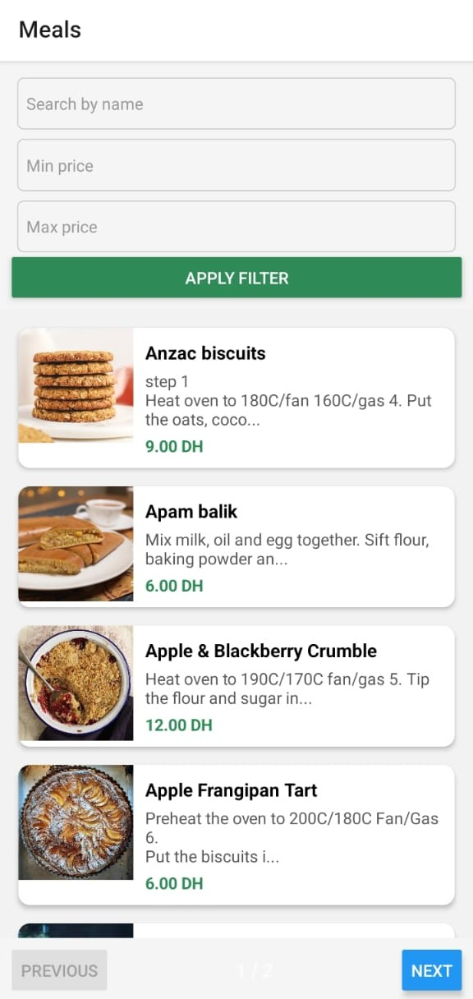
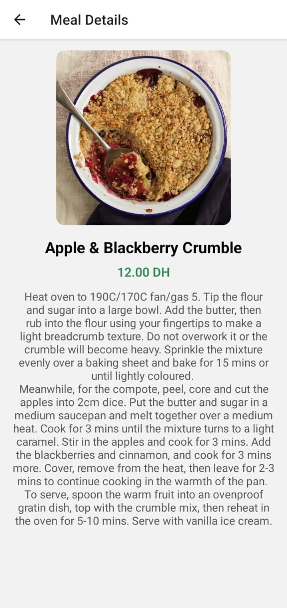

# 🍽️ Meals App

Meals App is a simple mobile application built with **React Native** and **TypeScript** that allows users to browse meals, filter them, and view detailed information about each meal.

The application retrieves meals from an API, assigns a price to each meal, and displays them in a clean and user-friendly list format. Users can filter meals by **name** and **price range**, navigate through pages, and open a **meal detail page** for more information.

---

## 📱 Screenshots

### 🔹 Meals List Screen



### 🔹 Meal Detail Screen



---

## ✨ Features

- Fetch and display meals from an API  
- Filter meals by:
  - **Name**
  - **Minimum price**
  - **Maximum price**
- Pagination with **Next** / **Previous** buttons  
- View complete details of a selected meal  
- Modern and clean UI layout  

---

## 🛠️ Technologies Used

| Technology | Purpose |
|-----------|---------|
| **React Native** | Mobile UI framework |
| **TypeScript** | Strong typing support |
| **React Navigation** | Screen navigation |
| **Fetch API** | Data fetching from API |
| **React Hooks** | State and effect management |

---

## 🚀 Installation & Run

```bash
git clone https://github.com/kerkazou/appReactNative
cd mobile
npm install
npm run android   # or npm run ios
